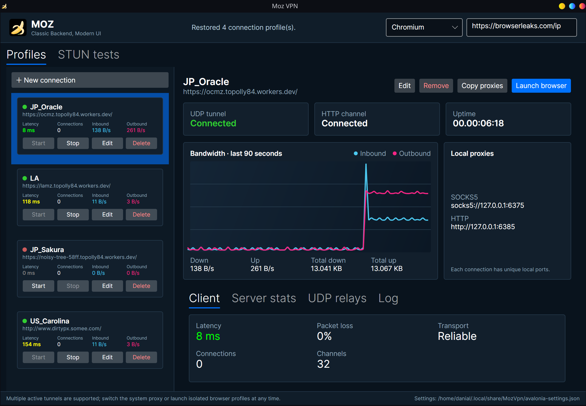
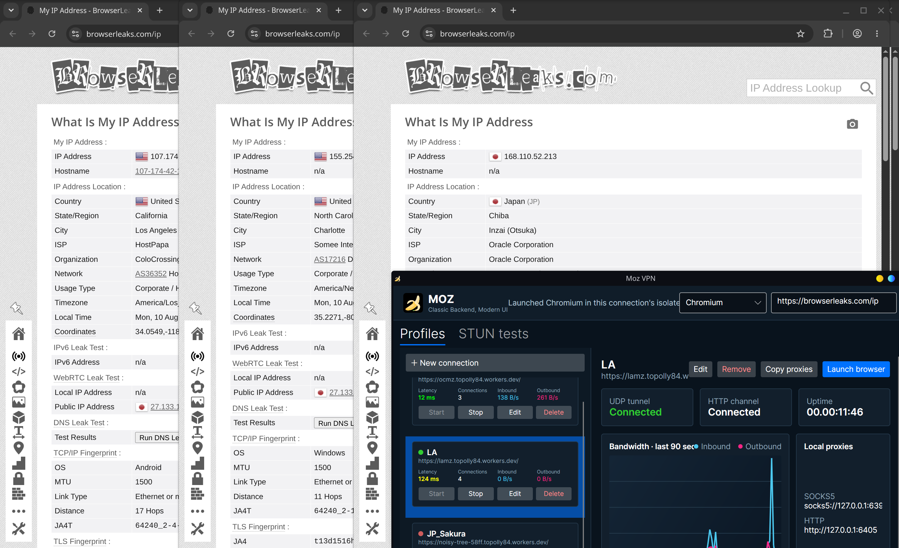

# Moz VPN :banana:
While the name suggests this mainly being used for VPN connections, This is a self-made UDP-Based protocol (using LiteNetLib) as a wrapper for TCP connections (can be anything, really, but I used socks5 to simplify things)
you could theoretically point the endpoint to any TCP host (server-side) and connect to it from the local proxy address of the client.
Socks5 and vless are tested. 
Moz does NOT terminate TLS. Connection security depends on the underlying protocol of your choice.

## Classes and Libraries
Main library, MozUtil, contains all the required classes for a MozConnection, usign an instance of MozManager.
Avalonia version is the latest and greatest, but there are CLI, WPF and MAUI versions (half-baked, for android) exist as well.

## Moz_Avalonia
Moz with Avalonia UI supports multiple simultanious active connections, as well as openening browsers with those connections directly from Moz VPN's UI. using chromium command line arguments, it sets the proxy server for that browser instance. browser sessions for each profile keep their own site data, persistent across sessions.



## Building Moz_Avalonia
Install the .NET 10 SDK, then run these commands from the repository root.

Build and run the desktop application locally:

```sh
dotnet build Moz_Avalonia/Moz_Avalonia.csproj -c Release
dotnet run --project Moz_Avalonia/Moz_Avalonia.csproj -c Release
```

Publish a self-contained, single-file Linux x64 executable:

```sh
dotnet publish Moz_Avalonia/Moz_Avalonia.csproj -c Release -r linux-x64 -f net10.0 --self-contained true -p:PublishSingleFile=true -p:PublishReadyToRun=true -o artifacts/Moz_Avalonia/linux-x64
```

Publish a self-contained, single-file Windows x64 executable:

```sh
dotnet publish Moz_Avalonia/Moz_Avalonia.csproj -c Release -r win-x64 -f net10.0 --self-contained true -p:PublishSingleFile=true -p:PublishReadyToRun=true -o artifacts/Moz_Avalonia/win-x64
```

Publish Android App Bundle (AAB for Google Play Store) and APK (for sideloading):

```sh
# Build Google Play Store AAB
ANDROID_HOME=~/Android/Sdk dotnet publish Moz_Avalonia.Android/Moz_Avalonia.Android.csproj -c Release -p:AndroidPackageFormat=aab -p:AndroidGenerateAppBundle=true -p:RunAOTCompilation=true -o artifacts/Moz_Avalonia/android-aab

# Build direct APK installation package
ANDROID_HOME=~/Android/Sdk dotnet publish Moz_Avalonia.Android/Moz_Avalonia.Android.csproj -c Release -p:AndroidPackageFormat=apk -p:RunAOTCompilation=true -o artifacts/Moz_Avalonia/android-apk
```

The resulting applications are:

- `artifacts/Moz_Avalonia/linux-x64/Moz_Avalonia`
- `artifacts/Moz_Avalonia/win-x64/Moz_Avalonia.exe`
- `artifacts/Moz_Avalonia/android-aab/com.duckyvpn.mozvpn-Signed.aab` (Google Play)
- `artifacts/Moz_Avalonia/android-apk/com.duckyvpn.mozvpn-Signed.apk` (Sideload)

Trimming and NativeAOT are intentionally disabled on desktop targets. The current application and networking dependencies use reflection without complete trimming annotations, so enabling either optimization is not considered safe yet. On Android, managed assemblies are compiled Ahead-of-Time (AOT) to native machine code.

See [`Moz_Avalonia/README.md`](Moz_Avalonia/README.md) for architecture and usage details.
